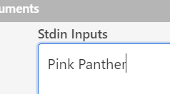

# COBOL-Beginners-Course
#### A beginners course in COBOL (på svenska)

### Getting started
Först, öppna <a href="https://www.jdoodle.com/execute-cobol-online" target="_blank">jdoodle for COBOL</a> (högerklicka och välj Öppna länk i ny flik).

Sen klickar vi på den skojiga kvadraten


Det ger en snyggare layout (tycker jag i alla fall ;-))

### Några ord om COBOL
jdoodle ger oss lite COBOL-kod att utgå ifrån. Det är viktigt att förstå att när man ska skriva ett nytt program så börjar man aldrig från noll. På SEB genererar vi faktiskt ut massor med kod, och sen fyller man endast på med *affärslogik* som gör det programmet unikt.

Ser koden kanske lite konstigt ut? När man designade språket COBOL var det viktigt att det skulle likna vanlig engelska. Därför är språket indelat i *divisioner*, *sektioner*, *paragrafer* och *meningar*. Ser ni DIVISION och SECTION någonstans i koden? Det finns inga paragrafer här, men varje kodrad avslutas med en punkt – meningar. Men på SEB har vi endast några specialparagrafer och vi avslutar INTE varje kodrad med punkt – det ställer bara till det. Man kan kanske säga att vi skriver meningslösa program ;-)

Det är alltså meningen att det ska vara lätt att läsa COBOL. Det syns inte minst i kodraden
<code>ADD X Y GIVING Z</code>. Ganska självklart vad som händer här, inte sant?
Även om du aldrig sett COBOL eller annan kod förut kan du kanske gissa vad detta lilla program gör? När du funderat en stund över det kan du **klicka på den blå Execute-knappen**, så körs programmet. Vad fick du för resultat i den svarta Result-rutan?

### Working storage och Procedure Division
Det står **_Working Storage_** i koden. Härunder *deklarerar man sina variabler*. En variabel är ett namn på ett stycke minne. <code>X PIC 99.</code> betyder "variabeln X är två bytes minne med två siffror".

Under **_Procedure Division_** har vi själva koden som gör något. Den avslutas här med <code>STOP RUN.</code> som alltid kan få stå kvar (inklusive punkten!) sist i programmet.

### Aritmetik
Låt oss bygga på med lite mer matte :-) **Ta bort all kod under Procedure Division** (förutom STOP RUN.).
Skriv eller klistra in följande kod istället
```COBOL
MOVE 10 TO X
ADD 1 TO X
SUBTRACT 1 FROM X
MULTIPLY 6 BY X
DIVIDE 3 INTO X
DISPLAY "X="X
```
Vad kommer X vara när programmet kört klart? **Klicka på Execute så får vi se!**

### Aritmetik, forts.
Som vi redan sett kan resultatet av en matematisk operation sparas i en annan variabel med <code>GIVING</code>. Vi testar att skriva om vår DIVIDE såhär:<br />
```COBOL
DIVIDE X BY 3 GIVING Y REMAINDER Z
```
Och vår DISPLAY såhär:
```COBOL
DISPLAY "X="X " Y="Y " Z="Z
```
**Vad kommer X, Y och Z ha för värden?**
**Vad betyder det att Z är noll?**


När man har att göra med mer komplicerade matematiska uttryck kan man ta till <code>COMPUTE</code>. Man kan faktiskt ersätta vår tidigare kod med följande och få samma resultat:
```COBOL
MOVE 10 TO X
COMPUTE Y = (((X + 1) - 1) * 6) / 3
DISPLAY "Y="Y
```
Klistra in koden ovan innan STOP RUN., klicka på Execute och se efter.

Vilken kod var lättast att läsa och förstå?

### Inmatning
Vi har kommit en bit i vår förståelse av programmering. Men ett program blir förstås mera värdefullt om det kan interagera med omvärlden.
För att ta in värden till variabler i COBOL-programmet används <code>ACCEPT</code>. Men först måste vi ha en lämplig variabel.
I Working Storage, skriv in följande
```COBOL
01 A-ARBETSAREOR.
   05 A-DATUM      PIC X(8).
```
Här har vi deklarerat en gruppvariabel A-ARBETSAREOR med ett enda fält, A-DATUM, som är åtta *alfanumeriska tecken* långt. Det är en bra praxis att sortera in sina variabler på detta vis i COBOL!

Och nu kan vi koda såhär:
```COBOL
ACCEPT A-DATUM FROM DATE YYYYMMDD
DISPLAY "Dagens datum: "A-DATUM
```
Execute!

### Inmatning forts.
Nu ska vi hämta in ett värde från användaren av programmet. Det är du :-)
Till gruppen A-ARBETSAREOR lägger vi till
```COBOL
   05 A-NAMN       PIC X(40).
```
Och i Procedure Division skriver vi
```COBOL
ACCEPT A-NAMN
DISPLAY A-NAMN
```
Innan vi kör programmet nu så måste vi ange ett namn. Det gör vi i rutan Stdin Inputs:



Execute!

Ser det rätt ut så långt så **lägger vi på samma sätt till variabeln A-ALDER och hämtar in användarens ålder i koden**. **Hur ska A-ALDER vara deklarerad? Var ska användaren ange sin ålder?**

### Ett riktigt program (typ)
Nu ska vi skriva ett riktigt program :-) Vi ska till att börja med utvärdera användarens ålder och avgöra om hon är gammal nog att få köra bil (minst arton), eller inte.
För det måste vi förstås ta in uppgifter om användaren (*input*) och leverera en rapport (*output*).
Skriv in följande i Working Storage:
```COBOL
01 UTVARDERING.
   05 RUBRIK.
      10 FILLER    PIC X(8)  VALUE "RAPPORT ".
      10 DATUM-RED PIC 9999/99/99.
      10 FILLER    PIC X(4)  VALUE SPACE.
      10 NAMN      PIC X(40).
   05 RESULTAT.
      10 FILLER    PIC X(30).
         88 BIL-NEJ VALUE 'Du får INTE köra bil.'.
         88 BIL-JA  VALUE 'Du får köra bil.'.
      10 FILLER    PIC X(30).
         88 SYS-NEJ VALUE 'Du får INTE gå på bolaget.'.
         88 SYS-JA  VALUE 'Du får gå på bolaget'.
```
Denna grupp använder vi i vår rapport.
"FILLER" tar upp minne, men går inte att manipulera. Vilket kan vara rätt så användbart faktiskt.

"88" är en riktig COBOL-specialare! Dessa kan man sätta till "SANT", och då antar variabeln de hör till värdet i VALUE-satsen.
Samtidigt sätter man andra 88-or, som har något annat värde i sin VALUE-sats, till "FALSKT".

I COBOL, liksom i alla programmeringsspråk, kan man välja väg i programmet beroende på *villkor* med **_IF-THEN-ELSE_**. Det kan se ut såhär:
```COBOL
IF A-ALDER >= 18 THEN *> Detta är en kommentar om att ">=" betyder "större än eller lika med".
   SET BIL-JA TO TRUE
ELSE
   SET BIL-NEJ TO TRUE
END-IF
```
Vill man skriva lite mindre så kan man faktiskt utesluta "THEN", det fungerar ändå.
Vill man skriva lite *mera* så kan man istället på typiskt COBOL-manér skriva samma sak såhär
```COBOL
IF A-ALDER IS GREATER THAN OR EQUAL TO 18 THEN
```

Lägg också till detta i koden:
```COBOL
MOVE A-DATUM TO DATUM-RED
MOVE A-NAMN  TO NAMN
DISPLAY RUBRIK
DISPLAY RESULTAT
```
Exekvera programmet. Hur gick det?

(Ser du hur datumet skrevs ut? COBOL har flera sådana formateringstrick, men det bör nog poängteras att numera är COBOL ett *backend-språk* och presentationslagret skrivs sannolikt i något annat programmeringsspråk.)

### Ett riktigt program (typ), forts.
Som du kanske noterat vill vi i programmet också kunna rapportera ifall användaren är gammal nog att handla på Systembolaget.
**Extraövning: Kan du lägga till en till IF i den IF vi redan har för att kunna rapportera detta korrekt?**

Att ha IF i IF kallas för *nästlad IF*. I detta fall var det kanske inte så farligt, men det kan ganska snabbt bli lite grötig kod om man har flera saker man måste hålla reda på i sitt program.
Liksom i andra språk (där det kanske kallas *switch*) så kan man i COBOL "välja väg" beroende på värdet på en variabel, som A-ALDER här. I COBOL gör man det med EVALUATE:

```COBOL
EVALUATE A-ALDER
WHEN 0 THRU 17
   SET BIL-NEJ TO TRUE
   SET SYS-NEJ TO TRUE
WHEN 18
WHEN 19
   SET BIL-JA  TO TRUE *> Hit kommer vi både för 18 och 19!
   SET SYS-NEJ TO TRUE
WHEN OTHER
   SET BIL-JA TO TRUE
   SET SYS-JA TO TRUE
END-EVALUATE
```

Men EVALUATE i COBOL är ovanligt kraftfullt! Skriver man <code>EVALUATE TRUE</code> kan man ha valfria villkor med valfria variabler!

```COBOL
EVALUATE TRUE
WHEN A-NAMN = 'Pink Panther'
   MOVE 'Du är ju Rosa Pantern! Du står över lagen!' TO RESULTAT
WHEN A-ALDER < 18
   SET BIL-NEJ TO TRUE
   SET SYS-NEJ TO TRUE
WHEN A-ALDER >= 18 AND < 20
   SET BIL-JA  TO TRUE
   SET SYS-NEJ TO TRUE
WHEN OTHER
   SET BIL-JA  TO TRUE
   SET SYS-JA  TO TRUE
END-EVALUATE
```

(Notera att i EVALUATE är *break* inbyggt default, som det borde vara i alla andra språk också. Men som sagt, EVALUATE i COBOL är ovanligt bra ;-))

### [Intro till PERFORM! Inte självklart hur det passar in i kursen hittills...]

### FizzBuzz (extraövning)
Nu har du lärt dig tillräckligt mycket för att lösa den klassiska programmeringsnöten FizzBuzz.
Låt användaren skriva in valfritt (positivt) heltal, N. För alla n=1,2,3...,N, skriv ut n. Men om n är jämnt delbart med 3, skriv istället ut "Fizz". Om n är jämnt delbart med 5, skriv istället ut "Buzz". Men om n är jämnt delbart med *både* 3 och 5, skriv istället ut "FizzBuzz".
Det ska alltså se ut såhär, för N=15:
```COBOL
01
02
Fizz
04
Buzz
Fizz
07
08
Fizz
Buzz
11
Fizz
13
14
FizzBuzz
```

Ett lösningsförslag, FizzBuzz.cob, ligger i detta GitHub-repo, om du vill ta dig en titt.
